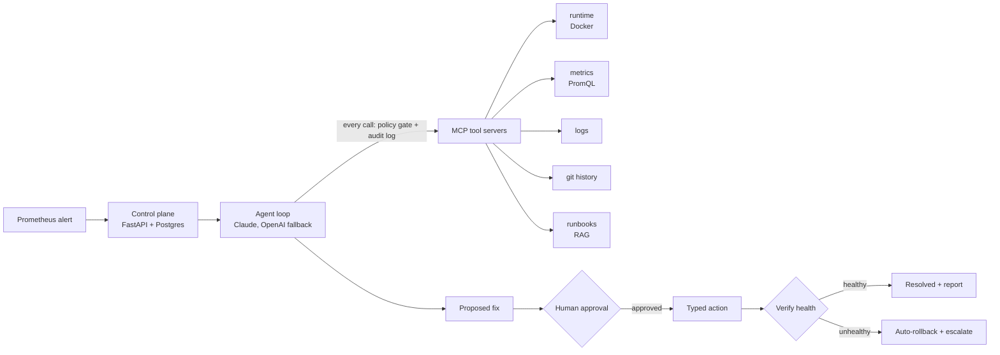

# SentinelOps

**An AI agent for incident response that gathers evidence before it acts, and never acts without a human's approval.**

When a production alert fires, SentinelOps investigates the way an on-call engineer would. It
queries metrics, reads logs, inspects containers, and checks recent deploys and runbooks. Then it
writes a root-cause analysis in which every claim cites the tool call that supports it. It
proposes one fix from a fixed set of typed actions and waits for a human to approve. After running
the fix, it checks that the service is healthy again, and rolls back automatically if it isn't.

A benchmark of injected faults measures how well this works, compared with the project's first
version.

> **Status: in active development.** The demo environment is running and tested. The agent,
> remediation, and benchmark are being built now. See the [roadmap](#roadmap).

---

## Why this exists

The first version of this project, **IncidentPilot** (kept in [`legacy/`](legacy/v1-incidentpilot/)),
was a RAG copilot: ChromaDB, gpt-4o-mini and a Streamlit UI. Reviewing it turned up a serious
failure:

- Its MCP client import failed (`FastMCPClient` does not exist in `mcp` 1.13.0), and the
  exception was **silently swallowed**.
- As a result, **no real metrics ever reached the model**, and it confidently invented "metric
  correlations."
- Smaller bugs were hiding behind that one: the time-window filter compared ISO strings to epoch
  integers, the vector index went stale with no chunking, and invalid JSON had no fallback.

An assistant that sounds right but has no evidence is worse than having no assistant.
SentinelOps is the answer to that failure:

| IncidentPilot (v1) | SentinelOps (v2) |
|---|---|
| Retrieves similar past incidents and guesses | Gathers live evidence through tools |
| Tool errors are swallowed | Errors are always surfaced, never hidden |
| Claims have no citations | Every claim cites the tool calls behind it |
| Advice only | Typed actions → human approval → verification → auto-rollback |
| Not measured | Benchmarked against v1 on injected faults |

## How it works

Full details are in the [design doc](docs/design.md).



Each incident moves through a strict sequence of states:

```
OPEN → INVESTIGATING → PROPOSED → APPROVED → EXECUTING → VERIFYING → RESOLVED | ESCALATED
```

## Safety model

These are design rules, enforced in code:

- **Diagnostics are read-only.** Investigating tools can look but never change anything.
- **No free-form commands.** The model can only choose from typed actions defined in code
  (`rollback`, `restart`, `scale`, `set_flag`). There is no shell access and never `shell=True`.
- **A human approves every action**, and the approval is recorded before anything runs.
- **Every action is verified afterwards.** If verification fails, the system rolls back and
  escalates automatically.
- **Everything is audited.** Every LLM call and tool call is logged with timing, tokens and cost.
- **Errors are never silently swallowed.** This is the v1 bug this project exists to fix.

## The demo environment

SentinelOps needs something real to break and repair, so the repo ships a small microservice
stack that runs in Docker Compose:

```
loadgen ──► gateway ──► orders ──► payments
                          │
                          ▼
                      Postgres            Prometheus scrapes all three services every 5 s
```

- **gateway, orders and payments** are small FastAPI services. Each one exposes `/health` and
  `/metrics` (request counts, latency histograms, and `app_build_info` with the running version).
- **loadgen** sends steady checkout traffic so there are always real metrics.
- **Every image is tagged with its git commit**, so a deploy is a real commit plus a new image
  tag. That makes "what changed?" an answerable question.
- **Starter alert rules:** `ServiceDown`, `HighErrorRate` (>5% 5xx) and `HighLatencyP95` (>1 s).
- **Every container has a memory limit.** The whole stack idles at about 365 MB, so it fits
  comfortably on an 8 GB laptop.

Failures are visible by design. When payments goes down, orders and gateway return a 502 with the
cause attached, and log it. Evidence of a fault always exists for the agent to find.

## Quickstart

**Requirements:** Python 3.12, [uv](https://docs.astral.sh/uv/), and a Docker runtime
([OrbStack](https://orbstack.dev/) or Docker Desktop). Everything runs on Apple Silicon (arm64).

```bash
git clone https://github.com/vraj138/SentinelOps.git
cd SentinelOps
cp .env.example .env     # add API keys (not needed for the demo stack)

make install             # install dependencies with uv
make test                # unit tests (no Docker needed)
make up                  # build and start the demo stack
make ps                  # check container health
```

Then try it:

```bash
curl -X POST localhost:8000/checkout     # place an order through the whole chain
open http://localhost:9090/alerts        # Prometheus alerts
```

Simulate an outage and watch the alerts fire:

```bash
docker compose -f infra/docker-compose.yml stop payments    # ServiceDown fires in ~35 s
docker compose -f infra/docker-compose.yml start payments   # clears about a minute later
make down                                                   # stop everything
```

| Service | URL |
|---|---|
| gateway | http://localhost:8000 |
| orders | http://localhost:8001 |
| payments | http://localhost:8002 |
| Prometheus | http://localhost:9090 |
| Postgres | `localhost:5432` (user, password and database: `sentinelops`) |

## Roadmap

- [x] Project skeleton: uv, ruff, pytest, typed settings
- [x] Demo stack: three services, Postgres, Prometheus, alert rules, load generator
- [x] [Design doc](docs/design.md)
- [ ] Fault injectors: bad deploy, memory leak (OOM), DB connection exhaustion, slow dependency,
      bad feature flag, missing secret. Some variants include a red-herring deploy.
- [ ] MCP tool servers: runtime, metrics, logs, git, runbooks
- [ ] Agent loop with a cited root-cause analysis
- [ ] Typed remediation actions, approval flow, verification, auto-rollback
- [ ] Benchmark: record and replay runs, scoring, v1 baseline, repeated runs per scenario
- [ ] Hardening: audit log, budgets and timeouts, model fallback, cost dashboard
- [ ] Docs: deployment guide, limitations, demo video

## Results

The benchmark has not run yet. This section will hold measured results: root-cause accuracy,
correct-remediation rate, harmful-action rate, time, tokens and cost per incident, each compared
with the v1 baseline. Every number will come with its run count and methodology. There will be
no placeholder figures here.

## Project layout

```
sentinelops/     control plane, agent, policy gate, evals (in progress)
mcp_servers/     one MCP server per tool domain (planned)
demo_app/        gateway, orders, payments, loadgen: the services we break on purpose
infra/           docker-compose.yml, Prometheus config and alert rules, Postgres init
faults/          fault injectors, one module per scenario (planned)
evals/           scenarios, recordings for replay, results
tests/           pytest suite
legacy/          v1 IncidentPilot, kept unchanged as the eval baseline
```

## Development

```bash
make lint      # ruff check + format check
make format    # auto-format and fix
make test      # pytest
```

Python 3.12 · FastAPI · Pydantic v2 · httpx · Prometheus · Postgres · Docker Compose ·
MCP Python SDK · Claude (primary) with OpenAI fallback

**Scope choices:** this version runs on Docker Compose rather than Kubernetes, and leaves out
Loki, Grafana, Slack and Jira integrations so the whole stack fits on a laptop. Infrastructure is
reached through backend interfaces, so other runtimes can be added later without touching the
agent.

## License

[Apache 2.0](LICENSE)
